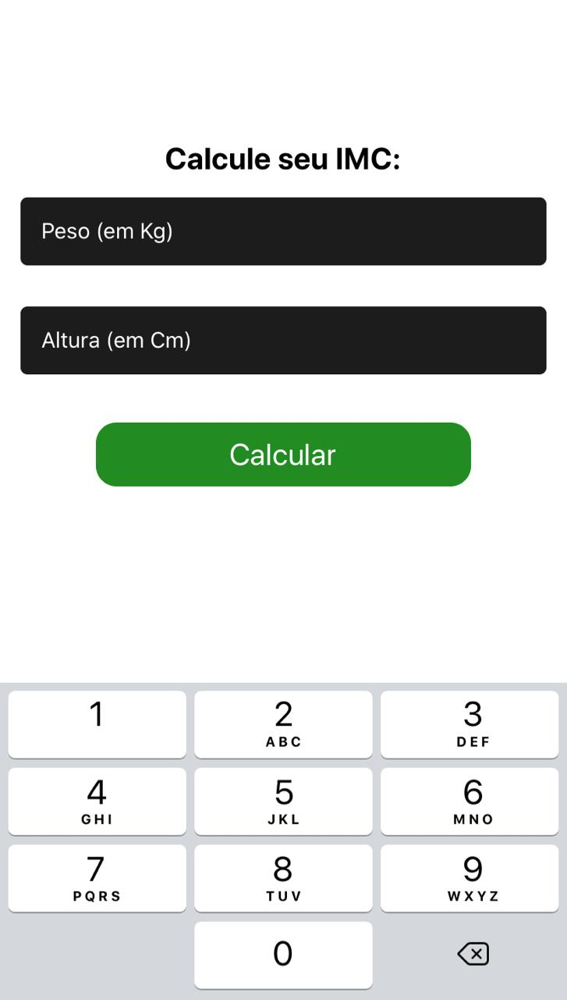

# Calculadora IMC

## Tecnologias Utilizadas

| [Javascript](https://www.devmedia.com.br/guia/javascript/34372)
| [React Native](https://reactnative.dev/docs/getting-started)
|

## O Projeto

<h3>Ao inserir seu peso e altura nos campos, será exibido seu IMC (Índice de Massa Corporal).</h3>

## Desenvolvedores

#### André Alcantara de Melo Pimentel:

 **Email:** a.pimentel10.ap@gmail.com
